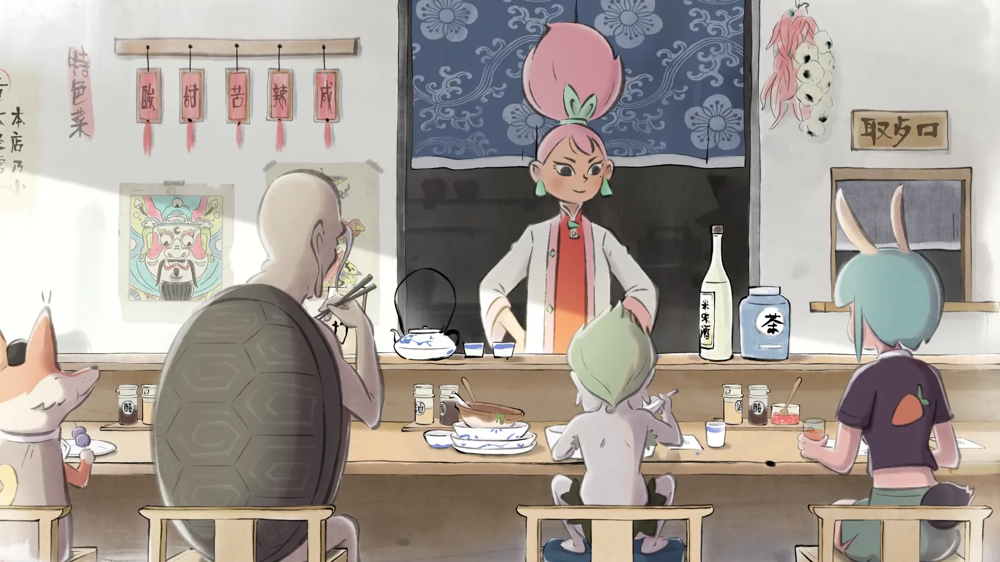

# 

#  Home

Welcome to Immersion-Based Chinese Learning, a website made for anyone and everyone interested in learning Chinese. Click on the button below to get started!

This guide is still a work-in-progress. Expect many changes over the next few days.

[:fontawesome-solid-rocket:{ .middle }&nbsp; Let's get started! ](./preamble.md){: .md-button .md-button--primary }  

---

## Credits
I would like to thank several people in the Japanese learning community, where I spend most of my time. First and foremost, I’d like to thank kuri, as much of this guide is based on their [Learn Japanese guide](https://donkuri.github.io/learn-japanese/).

I would also like to give special thanks to Cindsa for dedicating their time to help me write parts of this guide, and everyone who gave me various useful feedback.

I also want to give my appreciation for the Chinese learning community at large and everyone who made all the amazing resources mentioned in this guide. I’m very grateful for all the knowledge and support that made this possible.