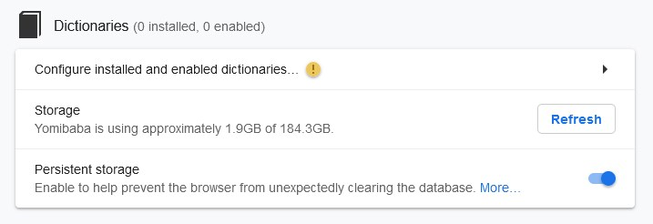

# Setup

In this section, we will go through how to setup the various tools we will use to learn Chinese, specifically [**Anki**](https://ankiweb.net/) and [**Yomitan**](https://yomitan.wiki).

- **Anki** is a powerful flashcard program that uses a spaced repetition algorithm to help you memorize Chinese vocabulary.
- **Yomitan** is a browser-based pop-up dictionary that allows you to quickly look up Chinese words while reading online content.

By the end of this section, you will have both tools installed and configured and ready to tackle your immersion studies.

<small>This section is adapted from [Kuri's Learn Japanese guide](https://donkuri.github.io/learn-japanese/setup).</small>

---

## Chinese Learning Setup 

### 1. Anki Setup

The first tool we are going to set up is Anki. But first, what exactly is Anki?

#### 1.1 What is Anki?

You're probably familiar with flashcards. You take a piece of paper, write a question or prompt on the front of the card, and then write the answer on the back. This memorization technique has been around for centuries, but on its own it's not the most effective.

This is where Anki comes in. 
Anki is a **Spaced Repetition-based Flashcards** program. In Anki, newly introduced and more difficult flashcards are shown more frequently than older and easier ones. This principle reinforces the material you’re struggling with while spending less time to review the material you've already mastered. As a result, Anki helps you learn more efficiently and remember things better. For this, Anki is not only popular among language learners but also widely loved by medical students around the world.
However, using vanilla Anki alone is still not enough[^1]. In the following, I will walk you through how to get to a good mining setup.

!!! warning "MacOS"
    I can only ensure that this guide works well for Windows and Linux. The general steps should still be the same if you are using Mac however, and hopefully this guide is still useful to you. 

[^1]: You may find it helpful to check out [this article](https://cademcniven.com/posts/20210410/) to learn about these issues and gain a better understanding of how Anki works in general.

#### 1.2 Installing Anki

To install Anki on Windows, head to the [Anki homepage](https://apps.ankiweb.net/) and click on the blue download button. If you're on Linux, your distribution should have an Anki package.

Follow the instructions for your system and make sure you are getting the latest version. There are two possible options to download Anki: **Qt5** and **Qt6**. Get the **Qt6** version, it's better and the add-ons we are using are compatible. Once this is done, please read [this explanation on basic Anki terminology](https://docs.ankiweb.net/getting-started.html#key-concepts).

#### 1.3 Changing your settings

Before using Anki effectively, we must change the settings:

1. Open **Tools > Preferences**. You can find my recommended preferences [here](https://mega.nz/file/lyNSjKaY#gfknZasmfrOQBBHfZq7aqvXxd95TpIWvDp0hRdYpRqI).
2. Modify **deck settings** of your core or mining deck. See my recommended deck settings [here](https://mega.nz/file/0i9HGRpZ#wH9PnEiXG9uPw3NsfpjSgo_RQwRIGjgaukrRv711pJM).

!!! note
    For an explanation of why we add a learning step (which makes the main difference with vanilla Anki) along with various other interesting points on why we setup Anki the way we do, refer to [this document](https://animecards.site/ankisetup/).

#### 1.4 Installing fonts
I highly suggest you find a set of Japanese fonts that you really like. I personally use the [Noto Chinese family of fonts](#) //todo!. It is ultimately up to you to decide, but I recommend going for fonts that you won't mind looking at for a long amount of time, because you will. To install them in Windows, just right click on them and install.

#### 1.5 Installing basic add-ons
1. Download all the add-ons I have [here](https://mega.nz/file/gulBxRzK#k4euAk8-334S6oOuuEqs3wSf98a5ZJ04zAvZb_lnKOc).
2. Go to **Anki > Tools > View Files**, then unzip and drop them into the folder.

If you just want to see a visual list of all add-ons I have, scroll down.

Anki is customizable in two ways: The first one is the settings menu that can be found in the app itself, the second one is additional plug-ins (usually called add-ons) that you can find on Anki's add-on page. The main issue with vanilla Anki is the "ease problem" discussed in here. The problem arises when one misses a card repeatedly which lowers the ease factor on that card. Concretely, this means that you will see the card more and more. On vanilla Anki, the only way to push the ease factor back up is to press "Easy". But it is not clear why this distinction is meaningful, and it is not clear either what "Hard", "Good" or "Easy" represent when learning a language. We are going to sidestep the problem entirely by changing the way Anki deals with ease. To do this, we are going to use a few different add-ons.

##### General Add-ons

These add-ons are useful for everyone and every deck.

###### [Advanced Browser](https://ankiweb.net/shared/info/874215009)

As the name implies, this gives the browser featured more functionalities.

###### [Advanced Copy Fields](https://ankiweb.net/shared/info/1898445115)

Lets you replace and copy things from your Anki fields. It also lets you create some cool custom templates from the fields themselves.

###### [AutoReorder](https://ankiweb.net/shared/info/757527607)

AutoReorder is an add-on that lets you re-order your new cards based on a frequency field. It will be used in conjunction with [Marv's frequency sorter](https://github.com/MarvNC/JP-Resources#sorting-mined-Anki-cards-by-frequency) to allow one to use frequency dictionaries to mine effectively and have the most frequent new words come up first.

###### [Batch Editing](https://ankiweb.net/shared/info/291119185)

Batch Editing lets you edit entire batches of cards at once. This is very useful when you want to add something to every card in your deck in one go, for instance a picture.

###### [Edit Field During Review (Cloze)](https://ankiweb.net/shared/info/385888438)

Edit Field During Review lets you edit a card as you're reviewing it.

###### [More Overview Stats 2.1](https://ankiweb.net/shared/info/738807903)

More Overview Stats 2.1 gives you more stats to the deck overview.

###### [Pass/Fail <small>(optional)</small>](https://ankiweb.net/shared/info/876946123)

This add-on is optional. It removes the "Hard" and "Easy" buttons entirely, which is more of a matter of taste. Personally, I use it.

###### [Progress Graphs](https://ankiweb.net/shared/info/266436365)

Adds cool progress graphs to help you understand your Anki usage better.

###### [Study Time Stats](https://ankiweb.net/shared/info/1247171202)

Adds some time statistics on the main Anki window which is useful if you want to see how much time you spent on Anki this week for instance.

###### [Review Heat Map](https://ankiweb.net/shared/info/1771074083)

Review Heatmap lets you see your progress on the main page of Anki by showing you what days you did Anki and how many reviews you did.

###### [Straight Reward](https://ankiweb.net/shared/info/957961234) or [FSRS4Anki Helper](https://ankiweb.net/shared/info/759844606)

Straight Reward makes it so that hitting "Hard", "Good" or "Easy" is considered a success, and chaining together successes increases the ease factor, thus making you see the card less often (since you keep getting it right, you don't need to see it as much). **If you are using FSRS (see below), this has no effect and is not needed.**

If you are using FSRS, install FSRS4Anki Helper instead. It lets you customize some settings for FSRS.

###### [True Retention by Card Maturity Simplified](https://ankiweb.net/shared/info/1779060522)

This add-on gives you accurate information about your retention on mature and young cards.

##### Chinese-Specific Add-ons

These add-ons are directly related to Chinese learning and have no direct use for anything else.

###### [AnkiConnect](https://ankiweb.net/shared/info/2055492159)

This is by far the most important add-on for mining. It allows one to use Yomitan to create cards automatically, more on this in the mining section below.

#### 1.6 Enabling FSRS

FSRS is an alternative to the SM-2 algorithm for scheduling in Anki. I highly, highly suggest you use it. 
To do this, provided you are on Anki 23.10 or higher, you simply need to open **deck options > Advanced**. There, enable FSRS. I highly suggest you read [this tutorial](https://github.com/open-spaced-repetition/fsrs4anki/blob/main/docs/tutorial.md) to get acquainted with the algorithm and see how it works.

#### 1.7 Anki Setup Checklist
- [ ] [Install Anki.](#12-installing-anki)
- [ ] [Change settings.](#13-changing-your-settings)
- [ ] [Install fonts.](#14-installing-fonts)
- [ ] [Install add-ons.](#15-installing-basic-add-ons)
- [ ] [Enable FSRS.](#16-enabling-fsrs)  

---

### 2. Yomitan Setup

#### 2.1 What is Yomitan?
Yomitan is a browser-based pop-up dictionary that allows you to quickly look up words while reading online content[^2].

[^2]: // todo!

#### 2.2 Installing Yomitan

To install Yomitan, visit the [Yomitan homepage](https://yomitan.wiki) and download the extension for your browser. Upon installation, a quickstart guide will be presented to you. Be sure to read it to see how Yomitan works.

#### 2.3 Adding Dictionaries

Yomitan requires third-party dictionaries to function. To install the dictionaries, go to **Dictionaries > Configure installed and enabled dictionaries... > Import**.

The dictionaries will take a bit of time to import, it is normal. Install dictionaries in the order given here.

There are many really good dictionaries. Some of them are listed under the recommended dictionaries tab. What dictionaries to use is a bit of personal preference. You should feel free to have a look around if you care for it.

##### Chinese-English Dictionaries

###### [CEDICT](#)

General-purpose dictionary. // todo!

##### Grammar Dictionaries

This dictionary helps us noticing and understanding grammar patterns.

###### [Chinese Grammar Wiki](#)

// todo!

##### Chinese-Chinese Dictionaries

These dictionaries are monolingual, Chinese-Chinese dictionaries.

###### [Moedict](#)

Moe // todo!

##### Specialty Dictionaries

These dictionaries are also Chinese-Chinese but they focus on specific topics.

Here be dragons // todo!

##### Hanzi Dictionaries

This dictionary will help us understand hanzi, giving us the most common words for a specific hanzi, stroke order and other statistics.

Here be dragons // todo!

##### Frequency Dictionaries

Lastly, these dictionaries give us frequency informations for various words. This will be useful to sort new words by frequency (in Anki) which I prefer for absolute beginners. I recommend getting all of these as they allow you to have a more diversified frequency when sorting, but if you're only going to get one, make it //todo!.

Here be dragons // todo!

##### Other Possible Dictionaries

As mentioned above, feel free to take a look at other dictionaries on //todo! and on //todo!'s page.

#### 2.4 Configuring Yomitan

!!! tip "Recommended Settings"
    **You can simply get my recommended settings file [here](https://mega.nz/file/1nciCT5L#Ge5p04mG9DJut9hzDjfP--212TxcKGuMc3kLbNSdPN8). To import it, go under **Backup > Import Settings.** I cannot guarantee the rest of the setup works if you do not do this, because some important things require different settings in Yomitan, notably the mining portion of the guide.**

As I have said before, I suggest you take some time to read the startup usage guide and see how Yomitan works for yourself. After this, you can disable it showing up every time you open your browser by ticking off Show usage guide on startup in the Yomitan settings menu (press on the cog wheel) under General. Here are a few more options you can take a look at if you would like to.

##### Scanning

You can change the default modifier key from <kbd>Shift</kbd> to something else if you'd rather. You can also choose `No key` which automatically looks up any Chinese it comes across for you without having you press any button. It can make looking up a specific word in a sea of Chinese words a bit tedious, but it also doesn't require you to press <kbd>Shift</kbd> all the time. You're free to choose whichever option you prefer. I use both <kbd>Shift</kbd> and `No Key` depending on what I'm reading.

##### Popup

Here you can decide to use `Allow scanning popup content` or not. It lets you scan words in the definitions of your dictionaries which is useful when you're reading monolingual dictionaries in Japanese. If you enable it, you might want to change the number in `Maximum number of child popups` to something higher, like 3-5.

// todo! my personal rec is \infinity

##### Audio

You can adjust the volume audio if it is too loud for you. You can also add auto-play which immediately plays the audio of any word you look up. This is useful when using J-J dictionaries, but I personally don't use it. I highly suggest you set up a local audio server for Yomitan following [this guide](https://github.com/themoeway/local-audio-yomichan) if you haven't already done so.

// todo! Check if this works for Chinese

#### 2.5 Yomitan Setup Checklist
- [ ] [Install Yomitan.](#22-installing-yomitan)  
- [ ] [Add dictionaries.](#23-adding-dictionaries) 
- [ ] [Import my recommended settings.](#24-configuring-yomitan)  

// todo! Yomitan Shortcuts

---

This is the end of the setup guide. If you came here from the general guide, click [here](./guide.md#21-setting-up-anki-and-yomitan) to come back to where you left off. Happy studying! 🎌
